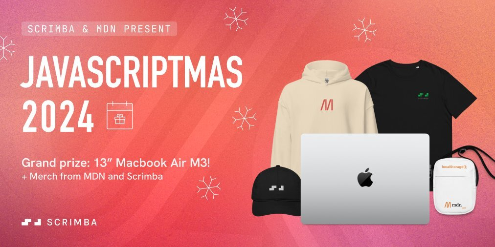

# JavaScriptmas 2024 Solutions

JavaScriptmas is free annual coding challenges from Dec 01 to Dec 24 hosted by [Scrimba](https://scrimba.com/) and [MDN](https://developer.mozilla.org/en-US/).These coding challenges are in HTML, CSS and JavaScript. Each day Scrimba will surprise you with thriller Projects.

## JavaScriptmas Prizes

- 13" MacBook Air M3
- Merch from MDN
- Lifetime Scrimba account

## How to participate in challenges

1- first of all join javascriptmas challenges using [JavaScriptmas](https://scrimba.com/javascriptmas)
2- solve challenges each day
3- share your solution using share on X button or you can use #javascriptmas on X (Twitter)

## javaScriptmas solutions here

I will provide solutions each day here on GitHub that you can check your solutions with me.
